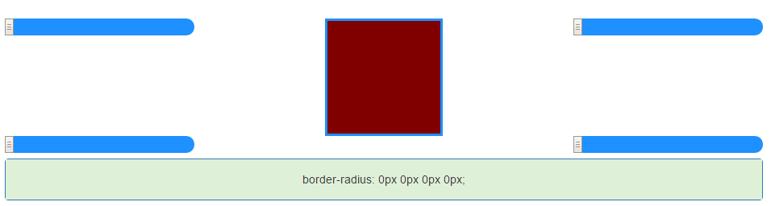

# So now what?
##_So you installed mini border radius.Right?Well there are a few things left to do.Each generator needs its own div to live on.So to create a new generator you have to do it like this:_

```var generator=new Generator("#sample");```
This is how a default generator looks like:



Instead of using the id of the host-parent div you can pass a list of 5 elements in the constructor like this:

```generator=new Generator([host_div_id,height,width,max_value,bg_color]);```

Now the first parameter of the list is the id of the host-parent div.The next 2 parameters determine the size of the generator in the page.The fourth value determines the max value for the sliders inside the generator and the last one determines the background color of the generator.There is also a third constructor(3rd way to create a generator) which takes 2 arguments.The first one can be the id of the host-parent div or it can be a list like the previous list.The second one parameter is the id of an existing object in your page.What is this object?This object is going to replace the default object that the generator uses to apply the border-radius property.

Example:
```generator=new Generator([host_div_id,height,width,max_value,bg_color],"#image");```

Let me tell you what the above code does.It look for an html element with the id "#image".It removes it from where it is and it replaces the default object used by the generator with this element.